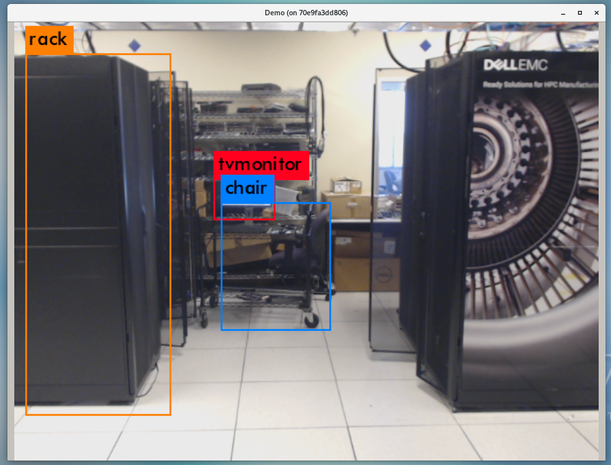

# Running RealTime Webcam Object Detection Demo

This documentation is a step by step guide to runninng the YOLO object detection demo with your webcam.





### Step 1. Check Validation System Specifications:

This demo is validated on a Dell PowerEdge C4130 system having the following specs:

```
##### H/W Specs:

* 2 X Intel(R) Xeon(R) CPU E5-2690 v4 @ 2.60GHz
* 256 GB DDR4 Ram Memory 
* 2TB disk space
* 4 X Nvidia Tesla P100 PCIe 16GB graphic cards.
* Logitech HD Pro Webcam C920

##### S/W Specs:
* CentOS Linux 7 (Core)
* Docker 1.13.1
* Git 1.8.3.1 
```


### Step 2. Ensure Prerequisites

Although you might not need an extensive system as the validation system, at the very least you need to have a base installation of Linux OS such as RHEL Centos or Ubuntu, Git and Docker.  This also requires atleast 4GB of disk space, 
an Nvidia GPU, a working webcam (that already has drivers installed). 

#### Some Tips In Centos 7: 
* You can check if the camera is installed by typing the following command on the terminal.

```
ls /dev/video*
```  

You must see the following as a result:  
```
/dev/video0
```

If you don't see anything or you see something like this **``ls: cannot access /dev/video*: No such file or directory``** then please go back and install the drivers for your 
webcam and confirm it works.


**If you don't have docker installed, the following links explain how to install docker.**

  
## Here is a video tutorial to install (Click below): 

[](https://www.youtube.com/watch?v=Oa886S17jus)


OR you can follow through these written articles: 

For Centos 
```
https://docs.docker.com/install/linux/docker-ce/centos/
```


For Ubunutu 
```
https://docs.docker.com/install/linux/docker-ce/ubuntu/
```


## Step 3. Running the Demo 


Once you confirm that the prerequisites are present, run the script that pulls the docker image.

First, clone the repo:
 
```
git clone https://github.com/dellemc-hpc-ai/yolo_demo.git
```

cd into the folder:
 
```
cd yolo_demo
```

Run the script 

```
bash run-yolo.sh
```
Note: If you have more than one webcam, please either use the webcam linked **``video0``** 
or alter the **``run-yolo.sh``** bash script which mounts to the docker volume to your preferred webcam. 

### Congrats, you made it. You must be able to see the demo run!

The container is hosted on Dockerhub at : https://hub.docker.com/r/dellemchpcai/yolo_demo 
